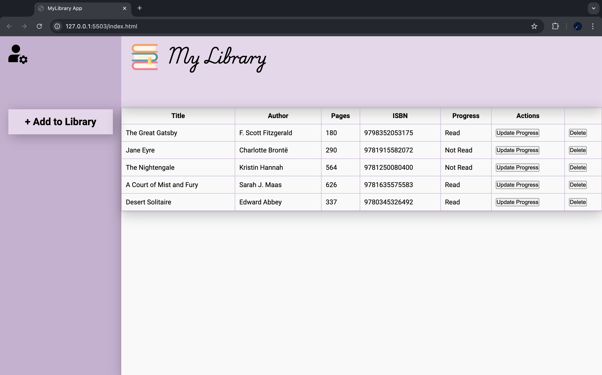
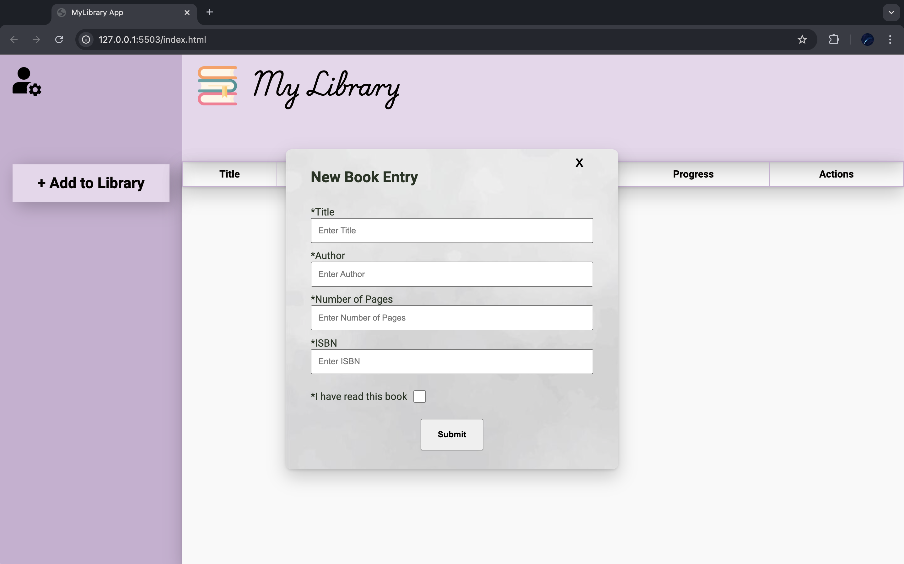

# Library Application

## Overview

This application is designed to serve as a digital library, allowing users to:

- Add books to their personal reading list.
- Mark books as "read" or "unread".
- Delete book entries from the database.

## Features

- Book Management: Users can add, remove, and update books in their reading list.
- Reading Status: Users can mark books as "read" or "unread" to track their progress.

## Technologies

- Frontend: HTML, CSS, JavaScript
- Backend: NodeJS

## Usage

- Fill out New Book Entry form to submit and post a new book entry
- Mark books as read: Check the "read" box for completed books.
- Delete book entries from the database

## Contributing

Contributions, issues and feature requests are welcome!

## Acknowledgement

Project inspitation from [The Odin Project](https://www.theodinproject.com/lessons/node-path-javascript-library)
